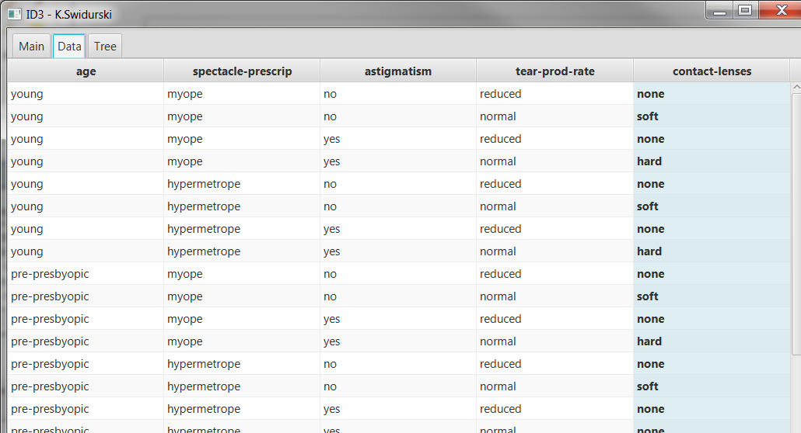
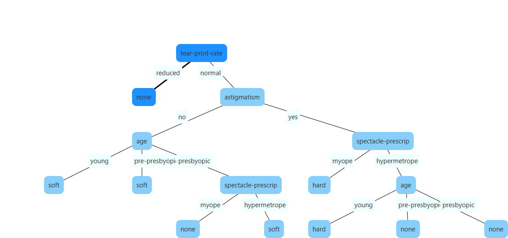

# Funkcje
- Wczytywanie pliku .CSV
- Wizualizacja wczytanych danych
- Budowanie drzewa decyzyjnego (algorytm ID3)
- Wizualizacja drzewa
- Mo¿liwoœæ zapisania drzewa do pliku
- Mo¿liwoœæ dodania nowego przyk³adu i zaznaczenia go na drzewie

# Uruchamianie
```maven
mvn jfx:run
```

# Screeny





